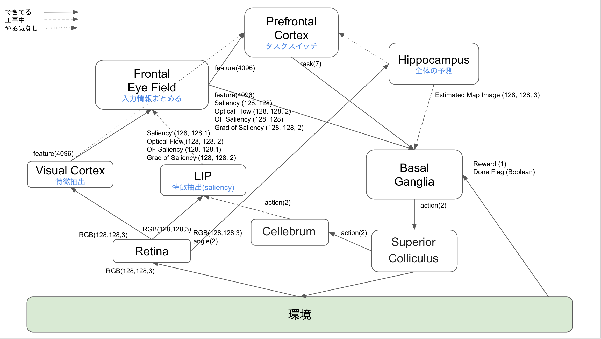

# WBAI_Hackathon2018

## コードの概要
### ディレクトリ階層
- cpu/ : CPUで学習させた際に使用したコード．
- gpu/ : GPUで学習させた際に使用したコード．

### 主に開発を行ったモジュール
- 大脳基底核（BG）：A2Cアルゴリズムを実装し，ドーパミンシステムにおける報酬予測誤差学習を再現した．
- 前頭前皮質（PFC）：入力情報から，タスクの認識を行い，そのラベルに応じて各特徴マップにおけるAttention分布を作成する．
- LIP：Saiency MapとOptical Flowを統一的に扱えるように勾配計算を行った．
- Visual Cortex：VGGモジュールを使用し，視覚野における特徴抽出を行った．

### 脳配線の概要図
